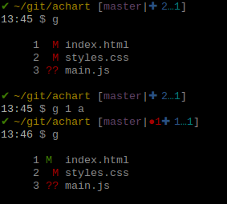
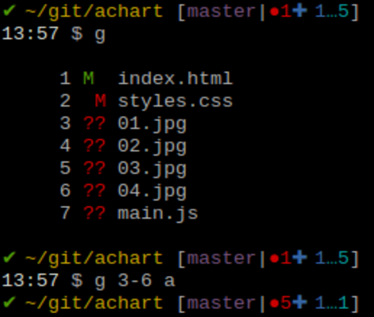
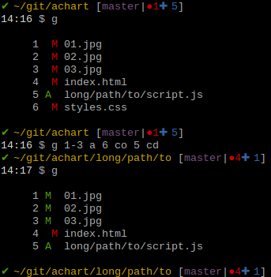

# G-Man

A simple bash script to accelerate your daily git workflow.

----

## Description

Gman builds upon `git status` to generate a numbered file list.

You can then simply refer to the files by their numbers instead of copy/pasting file names and paths.

Pre-configured commands and actions can be applied to the selected file(s) with various shorthands, such as `a` for `git add`.

A few quick examples :

```shell
g a 2     # `git add` on the file listed second in your git status. Yep, just three characters.
g t 3 4   # run tests on the third and fourth files
g d 2-4   # display diff for files 2 3 and 4
```

----

## Installation

Installing Gman is fairly simple, all you have to do is save the file and set up an alias to run it.
Using "g" as a shorthand for git-related stuff seems like the obvious thing to do. Just paste the following line wherever you store your aliases (.bashrc .bash_aliases etc.)
```shell
alias g='. ~/gman.sh'
```
Adjust the path according to where you saved the script.
Note: Gman has to be run in source mode (.) to enable some actions like `cd`ing to the directory of a file.

----

## Usage

Calling the script without arguments makes it run a `git status`.
The output is displayed as a numbered list and stored.
Upon calling the script again, with arguments, that stored list is then used.

It is stored in a text file inside the hidden `.git` folder of the current repository.
This allows you to use Gman simultaneously in each of the repositories you're working on.
Also, saving it in the `.git` folder doesn't pollute your local repository.

If there were changes (new files, commits...) in your repo, call the script without any arguments again
to refresh the list and make sure you are not performing actions on the wrong files.

| CLI | Details |
| --- | --- |
|  | Basic usage : specify a file's number, followed by the desired action. |
|  | Number range : in case you are too lazy.<br>One could also have typed `g 3 4 5 6 a` for the same outcome. |
|  | You can chain instructions, following the "file numbers - action" pattern.<br><br>In this example, files 1 2 and 3 are staged, file 6 is checked out, and we `cd` to the folder containing file 5. |


(Prompt on these screenshots is with <a href="https://github.com/magicmonty/bash-git-prompt" target="_blank">MagicMonty's bash-git-prompt</a>)

----

## Available commands
This is just a short list of some of the available actions.
For more details, and to customize them or add your own, take a look at the script : I have tried my best to keep my coding style as clean and expressive as possible.
Contributions for more custom commands are very welcome.

### Git related
| Command and shorthand | Description |
| --- | --- |
| add, a | `git add` |
| oops | adds file to the last non-pushed commit |
| r, reset | `git reset` |
| rm | `git rm || rm` (does a simple `rm` if the file isn't tracked) adding r to the command adds the -f parameter (eg: g rmf 3) |
| checkout, co, u | reverts changes to staged or unstaged file |
| diff, d | shows a `diff` of the file |
| dc | shows a `diff --cached` of the file |

### Eslint / Jest related
| Command and shorthand | Description |
| --- | --- |
| lint | run `eslint` on the file |
| fix | run `estlint --fix` on the file |
| t | Runs `jest` on the file, or runs the file itself if it is a test file.<br>It is configured for `file.js` &#8596; `file.test.js` file naming.<br>You might want to change this. |
| tc | `jest --coverage` |
| tw | `jest --watch` |
| tu | `jest --updateSnapshot` |
| tcwu | yep, you can combine ! |

### Filesystem related
| Command and shorthand | Description |
| --- | --- |
| cd | `cd` to the folder containing the file |
| bak | create a duplicate .bak of the file |
| vim, v | open the file with vim |
| nano, n | open the file with nano |
| vscode, vs | open the file with vscode |
| atom, o | open the file with atom |
| l | `ls` of the folder containing the file |
| ll | `ls -l` |
| la | `ls -a` |
| lla\|lal | `ls -la` |

# Misc.
| Command and shorthand | Description |
| --- | --- |
| copy, cp | Copies the selected files ine a one line format to the clipboard. |
| view | The default command when none is specified. Outputs a human readable of the selected files for a quick review before doing something regrettable afterwards. It also copies that list to the clipboard by also running the copy action afterwards. |
| print, p | simple output of the file(s) for piping xargsing `and` $(more)... |


----

## Customization

### Actions
You can of course add new actions to the script.
Look at the existing actions and inspire yourself from them.
If you come up with some cool stuff, please contribute :)

### Configuration
You can configure some of the actions of the script to suit your needs.
Find the user configuration variables at the beginning of the script and fill in your testing or linting commands, typical file extensions, etc.

### Arguments order
You can use Gman with reversed arguments order if you feel more comfortable with it.
For example you could type `g 2 a 3 n` to stage file number 2 and nano file number 3.
Try it out by supplying the `-t` parameter in first position (`g -t 2 a 3 n`)
If you want this to change permanently, you can edit the line `REVERSED=0` in the user config part of the script.

----

## Contribution

I have built this for my personal use, and to teach myself bash scripting. I am a front-end web developer and it is not my usual language, but I somehow enjoy it.

Many former colleagues have seen me use this tool and asked me to share it with them, and so I gladly did. But it's more convenient to share over github so... here we are :)

I have improved it and refactored it a few times and am always looking for advice and constructive criticism, so please feel free to contribute or comment about anything.

The major things that bother me right now are the extensive use of `eval` in order to support filenames with spaces, and running the script in source mode top enable changing folders.

----

## Related

The purpose of Gman is to keep things simple and easy. If you're looking for more, you might want to check out "scm-breeze".
